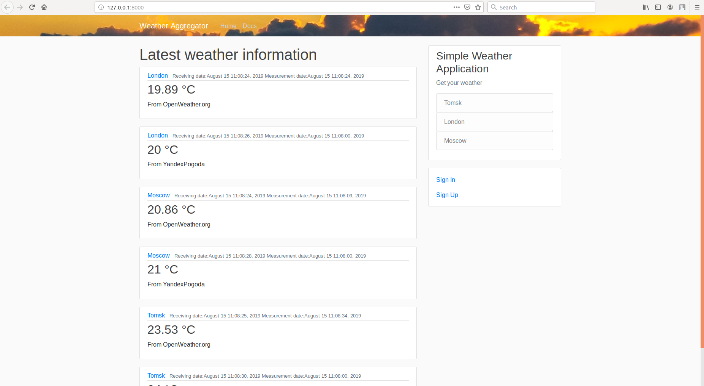

# Simple Weather project
The project was created as part of a test task for Improvado company

Enviroment: Ubuntu 16.04 + python 3.5

### Deploy app using Docker-compose 

- clone this [repo]( https://github.com/Iorgen/SimpleWeatherDeployment) to your computer 
- clone this [repo]( https://github.com/Iorgen/SimpleWeather) to your computer unzip and copy files inside src directory in SimpleWeatherDeployment
- create errors.log inside NEED TO WRITE THIS
- change SimpleWeatherDocker/src/SimpleWeather/settings.py to this.
    ```
    DEBUG = False
    ALLOWED_HOSTS = ['web']
    
    DATABASES = {
        'default': {
            'ENGINE': 'django.db.backends.postgresql_psycopg2',
            'NAME': 'postgres',
            'USER': 'postgres',
            'HOST': 'db',
            'PORT': 5432,
        }
    }
    
    ```
- move requirements.txt from **SimpleWeather** to **SimpleWeatherDocker/config/**
- Install docker using terminal 
   - Docker dependencies using this commands 
    ```
    sudo apt install -y \
    apt-transport-https \
    ca-certificates \
    curl \
    software-properties-common
    ```
    - add the docker key and repository
    
    ```
    curl -fsSL https://download.docker.com/linux/ubuntu/gpg | sudo apt-key add -
    sudo add-apt-repository \
    "deb [arch=amd64] https://download.docker.com/linux/ubuntu \
    $(lsb_release -cs) \
    stable"
    ```
-  update packages, install docker, start docker service and enable it to launch every time at system boot
    ```console
    sudo apt update
    sudo apt install -y docker-ce
    sudo systemctl start docker
    sudo systemctl enable docker
    ```
- check that docker working
    ```
    docker run hello-world
    ```

 
- Install Docker-compose
    ```
    sudo curl -L https://github.com/docker/compose/releases/download/1.21.0/docker-compose-$(uname -s)-$(uname -m) -o /usr/local/bin/docker-compose
    sudo chmod +x /usr/local/bin/docker-compose
    
    
    sudo curl -L https://github.com/docker/compose/releases/download/1.21.0/docker-compose-$(uname -s)-$(uname -m) -o /usr/local/bin/docker-compose
    sudo chmod +x /usr/local/bin/docker-compose
    ```

- check version
    ```
    docker-compose version
    ```
- Go to folder where you clone Docker project via terminal 
    ```
    cd ~/SimpleWeatherDocker/
    docker-compose build
    ```
- if you see:  
    ```
    ERROR: yaml.parser.ParserError: while parsing a block mapping
      in "./docker-compose.yml", line 1, column 1
    expected <block end>, but found '<block mapping start>'
      in "./docker-compose.yml", line 2, column 3
    ```
  go to [yaml](yaml-online-parser.appspot.com) and check your docker-compose.yaml
- Deploy poject and check that build and start was successful
    ```
    docker-compose up -d
    docker-compose ps
    docker-compose images
    ```
- Get Id of image with django and create super user for admin panel using the commands below
    ```
    sudo docker inspect --format="{{.Id}}" dg01 <--- Django Image name
    sudo docker exec -it dg01_id python manage.py createsuperuser
    ```

- Setup Cron Task Manager for hourly parsing 
    ```
    HERE SHOULD BE CRON TASK COMMANDS 
    ```

    
### For developing and scaling
- Clone this [repo]( https://github.com/Iorgen/SimpleWeather) to your computer


- Install postrgesql
   - Very good tutorial is [here]( https://djbook.ru/examples/77/) below just terminal commands from this tutorial
   
    ```
    # install 
    sudo apt-get install postgresql postgresql-server-dev-9.5
    # Open postgres console 
    sudo -u postgres psql postgres
    # Set root passwrod 
    \password postgres 
    # configure and create database 
    create user user_admin with password 'password';
    alter role user_admin set client_encoding to 'utf8';
    alter role user_admin set default_transaction_isolation to 'read committed';
    alter role user_admin set timezone to 'UTC';
    create database django_api_db owner user_admin;
    # exit the console 
    \q 
    ```
- Open terminal inside SimpleWeather project
- Checkout to develop branch 
    ```
    git checkout develop
    ```
- go to SimpleWeather/SimpleWeather/settings.py and change parameters below
    set inside settings.py this:
    ```
    # SECURITY WARNING: don't run with debug turned on in production!
    DEBUG = True
    ALLOWED_HOSTS = []
    DATABASES = {
        'default': {
            'ENGINE': 'django.db.backends.postgresql_psycopg2',
            'NAME': 'django_api_db',
            'USER': 'user_admin',
            'PASSWORD': 'password',
            'HOST': 'localhost',
            'PORT': '',
        }
    }
    ```
- Finally install all requirements, make database migrations using terminal from **SimpleWeather**
    ```
    cd ~/SimpleWeather
    pip3 install -r requirements.txt
    python3 manage.py collectstatic --no-input
    python3 manage.py makemigrations
    python3 manage.py migrate
    python3 manage.py runserver
    ```
- Run SimpleWeather using: 
    ```
    python3 manage.py runserver
    ```
- If you see in terminal : 
    ```
    Performing system checks...

    System check identified no issues (0 silenced).
    August 15, 2019 - 15:27:35
    Django version 2.2.4, using settings 'SimpleWeather.settings'
    Starting development server at http://127.0.0.1:8000/
    Quit the server with CONTROL-C.
    ```
    All successful and you can go to [http://127.0.0.1:8000]( http://127.0.0.1:8000/)  and there will be: 
  
    

# About 

### Api 

- site/api/v1/weather
    
- site/api/v1/weather/?city_name={city_name}

- site/api/v1/parse/
    
- site/api/v1/parse/?city_name={city_name}
    
- site/api/v1/parse/?city_name={city_name|city_name|city_name}
    

### Pages 
    # Html pages urls
    path('', views.home, name='ApiWeather-home'),
    path('city_weather/<str:city_name>/', views.city_weather, name='ApiWeather-city'),
    path('docs/', views.docs, name='ApiWeather-docs'),
    # Api urls
    path('api/v1/', include(weather_router.urls)),
    path('api/v1/parse/', views.weather_parser),
    # Api Documentation urls
    path('docs/openapi', get_schema_view(
        title="Your Project",
        description="API for all things …"
    ), name='openapi-schema'),

### Add city in database

DESCRIBE HOW TO ADD CITY INSIDE DATABASE 


### How to scale 
- About parsers
    
    Parsers app is WeatherParser  writing using template method 4 steps and 4 errors if something go wrong while parser working 
    
    BaseParser class contain 4 methods 
    
    - **prepare_url()** - each type of parsing starts from url - so this method help to prepare url for each parser type 
    
    - **send_request()** - when executing any type of request there is a general step to send a request to the specified address
    
    - **parse_response()** - after sending the request, we must extract information from the received response
    
    - **upload_to_database()** - when the information is received and converted to the desired format, it is necessary to save it in the created database
    
    each step can be defined for each parser individually, or we can use ready-made implementations 
    for the prepare_url, send_request and upload_to_database methods, overriding only the parse_response method
    
    parsing from html and from API kind a different ways to parse information, so for saving whole parsing template structure and effective scaling 
    two intermediate classes were implemented: 
       
    - BaseApiKeyParser contains the following variables:
    
    _city_param Every service has different names for the target parameter - city 
        
    _api_key_param, _api_key - Most public api services request authorization 
        
    - BaseHtmlParser

- Add parsers 
    - Using this template not so hard to create your own API parser
    ```
  
    class SOMEAPIPARSER(BaseApiKeyParser):
        # define name of parameter for city definition 
        _city_param = 'CITY_PARAMETER_NAME '
        # name of parameter for api key authorization 
        _api_key_param = 'API_KEY_NAME'
        # target url for this kind of parser
        _url = 'http://some_site/some/api/'
        # Api key definition
        _api_key = 'API_KEY_VALUE'
        # Additional params definition,
        _params = {
            "param1" : "value1"
            "param2" : "value2"
        }
        
        def __init__(self, **kwds):
            """ Class for parsing weather via API from 'http://some_site/some/api/' resource
            """
            # 
            super(OpenWeatherApiParser, self).__init__(**kwds)
            # Do common stuff in constructor, city independent
    
        def prepare_url(self, city):
            # prepare url, adding additional params or any other manipulations with url
            return url_value
    
        def parse_response(self, response, city):
            try:
                # HERE YOU CAN WRITE YOUR CODE FOR JSON, XML, etc parsing 
                weather_info = dict()
                # string
                weather_info['source'] = 'resource'
                # string
                weather_info['temperature'] = temperature_value 
                # integer
                weather_info['date'] = int(open_weather['dt'])
                # string
                weather_info['city_name'] = city
                # and return 
                return [weather_info]
            except Exception as e:
                logger.error(e)
                raise ResponseParsingException('Parsing Exception')
    ```
    
    - For html parsing it is even easier 
    
    ``` 
    class SOMEHTMLPARSER(BaseHtmlParser):
        # Just set the url 
        _url = 'http://some_site/some'
    
        def __init__(self, **kwds):
            super(YandexHtmlWeatherParser, self).__init__(**kwds)
    
        def prepare_url(self, city):
            # create url preparation algorithm
            return self._url + city
    
        def parse_response(self, response, city):
            try:
                # PARSE YOUR HTML WEB PAGE HERE 
                weather_info = dict()
                # string
                weather_info['source'] = 'resource'
                # string
                weather_info['temperature'] = temperature_value 
                # integer
                weather_info['date'] = int(open_weather['dt'])
                # string
                weather_info['city_name'] = city
                # and return 
                return [weather_info]
            except Exception as e:
                logger.error(e)
                raise ResponseParsingException('Parsing Exception')
    ``` 
  - include parser class name into parses array inside **SimpleWeather/WeatherParser/core/\_\_init__.py** 


